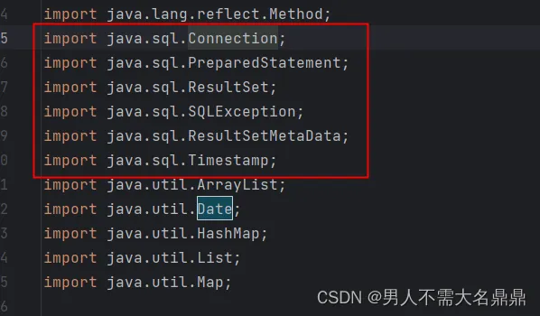
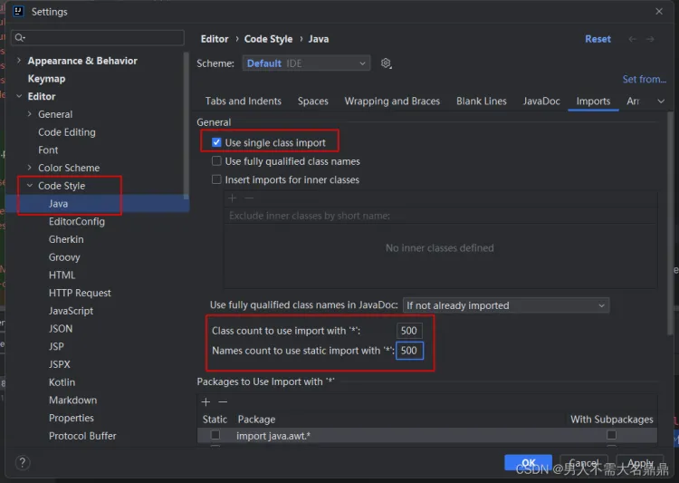

IDEA禁止自动导入包（import java.sql.）
IDEA禁止自动导入包
平常我们在写代码使用idea自动导入包时，默认同一个包下导入超过5条时就会自动变为引入，例如：

会自动变为
```
import java.sql.*;
```
但是一般我们的编程规范中，如google checkstyle和ali的checkstyle都不推荐导入，我们可以在idea中设置一下。

1. 打开Setting
2. 选择Editor -->Code Style–>Java–>Imports
   将下面的数字改为500，即为超过500条是import *


2. 点击Apply保持即可。

